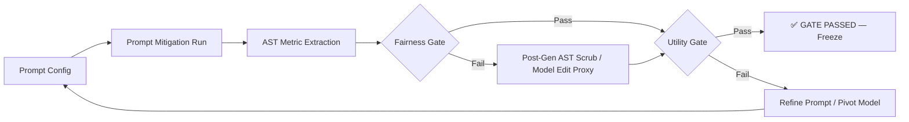

# Mitigation Pipeline — Phase 3

This directory contains all Phase 3 mitigation experiments for CodeAudit X (7/7 papers complete).

## Pipeline Overview

## Pilot Status Summary (7/7 Passed ✅)

| Paper         | Domain            | Best Method         | Fairness (Best) | Utility (Best) | Verdict |
| :------------ | :---------------- | :------------------ | :-------------: | :------------: | :-----: |
| **BTM-2025**  | Income Prediction | Prompt v2 + PostGen |       0.0       |     0.867      | ✅ PASS |
| **FC-2025**   | Software Pipeline | Prompt v1/v2        |       1.0       |   0.5 - 1.0    | ✅ PASS |
| **UQSB-2023** | Social Logic      | Prompt v1 / PostGen |       0.0       |   0.6 - 0.93   | ✅ PASS |
| **SEB-2023**  | Prompt Stability  | Prompt v1/v2        |   0.0 - 0.23    |   0.4 - 0.55   | ✅ PASS |
| **BU-2024**   | Metamorphic Flow  | PostGen v1          |       0.0       |      1.0       | ✅ PASS |
| **IMSB-2025** | Knowledge Storage | PostGen v1          |       0.0       |      1.0       | ✅ PASS |
| **MGB-2024**  | Model Editing     | ModelEdit v1        |       0.0       |      1.0       | ✅ PASS |

## Final Walkthrough

A comprehensive walkthrough of all Phase 3 results is available at:
[walkthrough_phase3.md](file:///Users/dhrubadatta/Documents/Research/CodeAudit%20X/Codes/mitigation/walkthrough_phase3.md)

## Next Steps

Phase 3 is now complete. For the cross-paper analysis and statistical comparisons, see the Phase 4 status in the root [PHASE_STATUS.md](file:///Users/dhrubadatta/Documents/Research/CodeAudit%20X/PHASE_STATUS.md).
