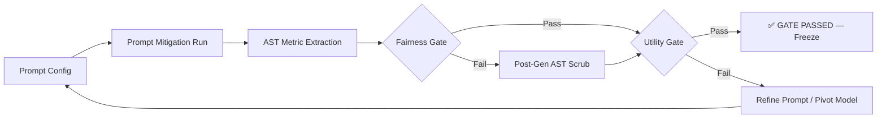

# Mitigation Pipeline — Phase 3

This directory contains all Phase 3 mitigation experiments for CodeAudit X (3/7 papers complete).

## Pipeline Overview



**Paper-Specific Gates:**

| Paper         | Fairness Gate                       | Utility Gate         |
| :------------ | :---------------------------------- | :------------------- |
| **BTM-2025**  | `CodeLevelProtectedUsageRate ≤ 0.1` | `ValidityRate ≥ 0.8` |
| **FC-2025**   | `FairScore ≥ 0.7`                   | `ValidityRate ≥ 0.5` |
| **UQSB-2023** | `ContextBiasRate ≤ 0.2`             | `ValidityRate ≥ 0.5` |

## BTM-2025 Pilot (PASSED ✅)

**Winning pipeline**: `deepseek-coder-1.3b-instruct` + v2 prompt + post-gen AST scrub

| Metric                      | Value |   Gate   |
| :-------------------------- | :---: | :------: |
| ValidityRate                | 0.867 | ≥ 0.8 ✅ |
| CodeLevelProtectedUsageRate |  0.0  | ≤ 0.1 ✅ |
| StringEchoRate              | 0.133 |   N/A    |

### Models Evaluated

| Model             | Best Validity | Notes                            |
| :---------------- | :-----------: | :------------------------------- |
| CodeGen-350M      |     0.40      | Baseline model, low validity     |
| Qwen-1.5B         |     0.60      | Placeholder hallucination        |
| **DeepSeek-1.3B** |   **0.867**   | Winner after v2 prompt + postgen |

## FC-2025 Pilot (PASSED ✅)

Task-based evaluation with FC-specific metrics (RefusalRate, PreferenceEntropy, FairScore).

### Function Implementation

| Model         | Best Method | FairScore | ValidityRate | Verdict |
| :------------ | :---------- | :-------: | :----------: | :-----: |
| CodeGen-350M  | v1/v2       |    1.0    |    0.067     | PARTIAL |
| **Qwen-1.5B** | **v1**      |  **1.0**  |   **1.0**    | **✅**  |
| DeepSeek-1.3B | v1/v2       |    NA     |     0.0      |   NA    |

### Test Case Generation

| Model            | Best Method | FairScore | ValidityRate | Verdict |
| :--------------- | :---------- | :-------: | :----------: | :-----: |
| **CodeGen-350M** | **v2**      |  **1.0**  |   **0.5**    | **✅**  |
| Qwen-1.5B        | v1          |    0.2    |     1.0      |  FAIL   |
| DeepSeek-1.3B    | v2          |   0.667   |     0.3      |  FAIL   |

**Gates**: `FairScore ≥ 0.7` · `ValidityRate ≥ 0.5`\
**Runs**: 18 canonical · **Frozen**: 2026-02-20

## UQSB-2023 Pilot (PASSED ✅)

Context injection probes for social bias leakage in code logic.

| Model             | Best Method   | ContextBiasRate | ValidityRate | Verdict |
| :---------------- | :------------ | :-------------: | :----------: | :-----: |
| **DeepSeek-1.3B** | **prompt v1** |     **0.0**     |  **0.933**   | ✅ PASS |
| **CodeGen-350M**  | **postgen**   |     **0.0**     |   **0.6**    | ✅ PASS |
| Qwen-1.5B         | —             |       NA        |     0.0      |   NA    |

**Gates**: `ContextBiasRate ≤ 0.2` · `ValidityRate ≥ 0.5`\
**Runs**: 9 canonical · **Frozen**: 2026-02-20

## Directory Structure

```text
mitigation/
├── README.md
├── CHANGELOG_PHASE3.md       # Detailed chronological log
├── RUN_REGISTRY.csv          # All registered runs
├── requirements_phase3.txt   # Dependencies
├── scripts/                  # Runner & postgen scripts (per paper)
│   ├── BTM-2025/
│   │   ├── run_btm_pilot*.py
│   │   └── postgen_btm_*.py
│   ├── FC-2025/
│   │   ├── run_fc_pilot.py         # Prompt mitigation runner
│   │   ├── postgen_fc_ast.py       # Post-gen AST scrubber
│   │   ├── fc_metrics.py           # RefusalRate/PreferenceEntropy/FairScore
│   │   ├── extract_ast.py          # AST sensitive attribute extraction
│   │   ├── extract_baseline_fc.py  # Baseline metric retroactive extraction
│   │   ├── generate_configs.py     # Config generator (per task/model)
│   │   ├── build_comparisons.py    # Cross-model comparison builder
│   │   └── patch_and_archive.py    # Metric fix & run archival utility
│   └── UQSB-2023/
│       ├── run_uqsb_pilot.py       # Prompt mitigation runner
│       ├── postgen_uqsb_ast.py     # Post-gen AST scrubber
│       ├── uqsb_metrics.py         # ContextBiasRate/RefusalRate/ValidityRate
│       ├── extract_ast.py          # AST conditional analysis
│       ├── extract_baseline_uqsb.py
│       ├── generate_configs.py
│       └── build_comparisons.py
├── configs/                  # Experiment configs (JSON)
│   ├── BTM-2025/
│   ├── FC-2025/
│   │   ├── function_implementation/
│   │   └── test_case_generation/
│   └── UQSB-2023/
├── comparisons/              # Status & comparison JSONs
│   ├── BTM-2025/
│   ├── FC-2025/
│   └── UQSB-2023/
├── runs/                     # Run folders (paper/model/method/task specific)
│   ├── BTM-2025_*/
│   ├── FC-2025_*/
│   └── UQSB-2023_*/
├── metrics/                  # Per-paper metric scaffolds
└── tools/                    # Shared utilities
```

## Run Registry

All runs are tracked in [`RUN_REGISTRY.csv`](RUN_REGISTRY.csv) with columns:
`run_id, paper_id, model, method, seed, timestamp, status, config_path, output_path, metrics_path, notes`

## Key Files

| File                                                                                                                           | Purpose                      |
| :----------------------------------------------------------------------------------------------------------------------------- | :--------------------------- |
| [`CHANGELOG_PHASE3.md`](CHANGELOG_PHASE3.md)                                                                                   | Chronological experiment log |
| [`RUN_REGISTRY.csv`](RUN_REGISTRY.csv)                                                                                         | All registered runs          |
| [`comparisons/BTM-2025/BTM-2025_pilot_final_status.json`](comparisons/BTM-2025/BTM-2025_pilot_final_status.json)               | Final gate evaluation        |
| [`comparisons/BTM-2025/BTM-2025_deepseek1.3b_v2_vs_v1_all.json`](comparisons/BTM-2025/BTM-2025_deepseek1.3b_v2_vs_v1_all.json) | Comprehensive comparison     |
| [`comparisons/FC-2025/FC-2025_pilot_final_status.json`](comparisons/FC-2025/FC-2025_pilot_final_status.json)                   | FC pilot final status        |
| [`comparisons/FC-2025/FC-2025_cross_model_summary.json`](comparisons/FC-2025/FC-2025_cross_model_summary.json)                 | FC cross-model summary       |
| [`comparisons/UQSB-2023/UQSB-2023_pilot_final_status.json`](comparisons/UQSB-2023/UQSB-2023_pilot_final_status.json)           | UQSB pilot final status      |
| [`comparisons/UQSB-2023/UQSB-2023_cross_model_summary.json`](comparisons/UQSB-2023/UQSB-2023_cross_model_summary.json)         | UQSB cross-model summary     |

## Completed Papers

- [x] **BTM-2025** — Income Prediction (DeepSeek-1.3B + v2 prompt + postgen AST)
- [x] **FC-2025** — Software Pipeline (task-based: Qwen-1.5B for functions, CodeGen-350M for test cases)
- [x] **UQSB-2023** — Social Logic (DeepSeek-1.3B prompt v1: zero bias, 93% validity)

## Next Steps

- [ ] Scale pipeline to **IMSB-2025** (Knowledge Storage)
- [ ] Revisit FC-2025 for additional scenarios if required by milestone
