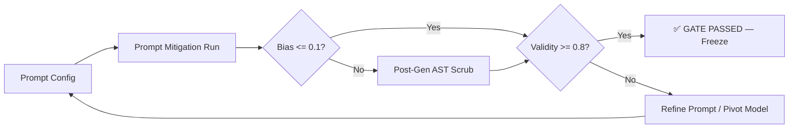

# Mitigation Pipeline — Phase 3

This directory contains all Phase 3 mitigation experiments for CodeAudit X.

## Pipeline Overview



## BTM-2025 Pilot (PASSED ✅)

**Winning pipeline**: `deepseek-coder-1.3b-instruct` + v2 prompt + post-gen AST scrub

| Metric                      | Value |   Gate   |
| :-------------------------- | :---: | :------: |
| ValidityRate                | 0.867 | ≥ 0.8 ✅ |
| CodeLevelProtectedUsageRate |  0.0  | ≤ 0.1 ✅ |
| StringEchoRate              | 0.133 |   N/A    |

### Models Evaluated

| Model             | Best Validity | Notes                            |
| :---------------- | :-----------: | :------------------------------- |
| CodeGen-350M      |     0.40      | Baseline model, low validity     |
| Qwen-1.5B         |     0.60      | Placeholder hallucination        |
| **DeepSeek-1.3B** |   **0.867**   | Winner after v2 prompt + postgen |

## Directory Structure

```text
mitigation/
├── README.md
├── CHANGELOG_PHASE3.md       # Detailed chronological log
├── RUN_REGISTRY.csv          # All registered runs
├── requirements_phase3.txt   # Dependencies
├── scripts/                  # Runner & postgen scripts (per paper)
│   └── BTM-2025/
│       ├── run_btm_pilot.py
│       ├── run_btm_pilot_deepseek1.3b.py
│       ├── run_btm_pilot_deepseek1.3b_v2.py
│       ├── run_btm_pilot_qwen1.5b.py
│       ├── run_btm_pilot_qwen1.5b_v2.py
│       ├── postgen_btm_ast_v1.py
│       ├── postgen_btm_deepseek_v1.py
│       ├── postgen_btm_deepseek_v2.py
│       └── postgen_btm_qwen_v2.py
├── configs/BTM-2025/         # Experiment configs (JSON)
├── comparisons/BTM-2025/     # Status & comparison JSONs
├── runs/                     # 12 registered run folders
│   ├── BTM-2025_codegen350M_*/
│   ├── BTM-2025_qwen1.5b_*/
│   ├── BTM-2025_deepseek1.3b_*/
│   └── _archive/             # 10 intermediate/failed runs
├── metrics/                  # Per-paper metric scaffolds
└── tools/                    # Shared utilities
```

## Run Registry

All runs are tracked in [`RUN_REGISTRY.csv`](RUN_REGISTRY.csv) with columns:
`run_id, paper_id, model, method, seed, timestamp, status, config_path, output_path, metrics_path, notes`

## Key Files

| File                                                                                                                           | Purpose                          |
| :----------------------------------------------------------------------------------------------------------------------------- | :------------------------------- |
| [`CHANGELOG_PHASE3.md`](CHANGELOG_PHASE3.md)                                                                                   | Chronological experiment log     |
| [`RUN_REGISTRY.csv`](RUN_REGISTRY.csv)                                                                                         | All registered runs (12 entries) |
| [`comparisons/BTM-2025/BTM-2025_pilot_final_status.json`](comparisons/BTM-2025/BTM-2025_pilot_final_status.json)               | Final gate evaluation            |
| [`comparisons/BTM-2025/BTM-2025_deepseek1.3b_v2_vs_v1_all.json`](comparisons/BTM-2025/BTM-2025_deepseek1.3b_v2_vs_v1_all.json) | Comprehensive comparison         |

## Next Steps

- [ ] Scale pipeline to **UQSB-2023** (Social Logic)
- [ ] Scale pipeline to **FC-2025** (Software Pipeline)
