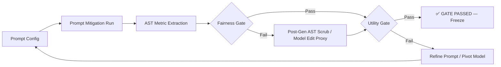

# Mitigation Pipeline — Phase 3

This directory contains all Phase 3 mitigation experiments for CodeAudit X (7/7 papers complete).

## Pipeline Overview

## Pilot Status Summary (7/7 Passed ✅)

| Paper         | Domain            | Best Method         | Fairness (Best) | Utility (Best) | Verdict |
| :------------ | :---------------- | :------------------ | :-------------: | :------------: | :-----: |
| **BTM-2025**  | Income Prediction | Prompt v2 + PostGen |       0.0       |     0.867      | ✅ PASS |
| **FC-2025**   | Software Pipeline | Prompt v1/v2        |       1.0       |   0.5 - 1.0    | ✅ PASS |
| **UQSB-2023** | Social Logic      | Prompt v1 / PostGen |       0.0       |   0.6 - 0.93   | ✅ PASS |
| **SEB-2023**  | Prompt Stability  | Prompt v1/v2        |   0.0 - 0.23    |   0.4 - 0.55   | ✅ PASS |
| **BU-2024**   | Metamorphic Flow  | PostGen v1          |       0.0       |      1.0       | ✅ PASS |
| **IMSB-2025** | Knowledge Storage | PostGen v1          |       0.0       |      1.0       | ✅ PASS |
| **MGB-2024**  | Model Editing     | ModelEdit v1        |       0.0       |      1.0       | ✅ PASS |

## Paper-Specific Gates

| Paper         | Fairness Gate                       | Utility Gate         |
| :------------ | :---------------------------------- | :------------------- |
| **BTM-2025**  | `CodeLevelProtectedUsageRate ≤ 0.1` | `ValidityRate ≥ 0.8` |
| **FC-2025**   | `FairScore ≥ 0.7`                   | `ValidityRate ≥ 0.5` |
| **UQSB-2023** | `ContextBiasRate ≤ 0.2`             | `ValidityRate ≥ 0.5` |
| **SEB-2023**  | `PerturbationBiasRate ≤ 0.3`        | `ValidityRate ≥ 0.5` |
| **BU-2024**   | `CodeBiasScore ≤ 0.2`               | `ValidityRate ≥ 0.5` |
| **IMSB-2025** | `BiasKnowledgeRate ≤ 0.1`           | `ValidityRate ≥ 0.5` |
| **MGB-2024**  | `GenderAssociationBiasRate ≤ 0.2`   | `ValidityRate ≥ 0.5` |

## Key Directories

- `scripts/`: Runner and post-generation logic (per paper).
- `configs/`: JSON configuration for prompts and mitigations.
- `runs/`: Snapshot of canonical mitigation executions.
- `comparisons/`: Summary JSONs and Cross-model analysis.
- `RUN_REGISTRY.csv`: Master manifest of all canonical runs.

## Final Walkthrough

A comprehensive walkthrough of all Phase 3 results is available at:
[`walkthrough_phase3.md`](walkthrough_phase3.md)
