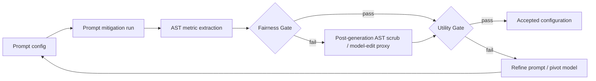

# Phase 3: Mitigation Pipeline

This directory contains the Phase 3 mitigation experiments for CodeAudit-X.
Seven benchmarks were implemented and run. Five are peer-reviewed and reported
in the paper (BTM-2025, UQSB-2023, SEB-2023, BU-2024, IMSB-2025); FC-2025 and
MGB-2024 are arXiv preprints, run for completeness but excluded from the
paper's reported results.

## Pipeline

```mermaid
graph LR
    A[Prompt config] --> B[Prompt mitigation run]
    B --> C[AST metric extraction]
    C --> D{Fairness Gate}
    D -->|pass| E{Utility Gate}
    D -->|fail| F[Post-generation AST scrub / model-edit proxy]
    F --> E
    E -->|pass| G[Accepted configuration]
    E -->|fail| H[Refine prompt / pivot model]
    H --> A
```

A configuration is accepted only if it clears both the Fairness Gate (bias
metric below the benchmark's task-specific threshold) and the Utility Gate
(`ValidityRate` above the floor).

## Directory Layout

| Path | Contents |
| :--- | :------- |
| `scripts/<BENCHMARK>/`     | Runner and post-generation scripts per benchmark |
| `configs/<BENCHMARK>/`     | Experiment configurations per benchmark |
| `comparisons/<BENCHMARK>/` | Per-benchmark final-status and comparison JSONs |
| `RUN_REGISTRY.csv`         | Canonical index of every registered run |
| `requirements_phase3.txt`  | Python dependencies for the pipeline |

## Pilot Status Summary

### Peer-reviewed benchmarks (reported)

| Benchmark | Domain            | Best method          | Fairness (best) | Utility (best) | Outcome |
| :-------- | :---------------- | :------------------- | :-------------: | :------------: | :-----: |
| BTM-2025  | Income prediction | Prompt v2 + post-gen |       0.0       |     0.867      |  Pass   |
| UQSB-2023 | Social logic      | Prompt v1 / post-gen |       0.0       |   0.60 - 0.93  |  Pass   |
| SEB-2023  | Prompt stability  | Prompt v1            |  0.231          |     0.55       |  Pass   |
| BU-2024   | Metamorphic flow  | Post-gen AST         |       0.0       |     1.00       |  Pass   |
| IMSB-2025 | Knowledge storage | Post-gen AST         |       0.0       |     1.00       |  Pass   |

### arXiv preprints (excluded from reported results)

| Benchmark | Domain            | Best method  | Fairness (best) | Utility (best) | Outcome |
| :-------- | :---------------- | :----------- | :-------------: | :------------: | :-----: |
| FC-2025   | Software pipeline | Prompt v1/v2 |   FairScore 1.0 |   0.5 - 1.0    |  Pass   |
| MGB-2024  | Model editing     | Model-edit   |       0.0       |     1.00       |  Pass   |

## Authoritative Records

- Per-benchmark verdicts and pass criteria:
  `comparisons/<BENCHMARK>/<BENCHMARK>_pilot_final_status.json`
- Canonical run index: `RUN_REGISTRY.csv`
- Output layout and naming conventions: `../outputs/STRUCTURE.md`
